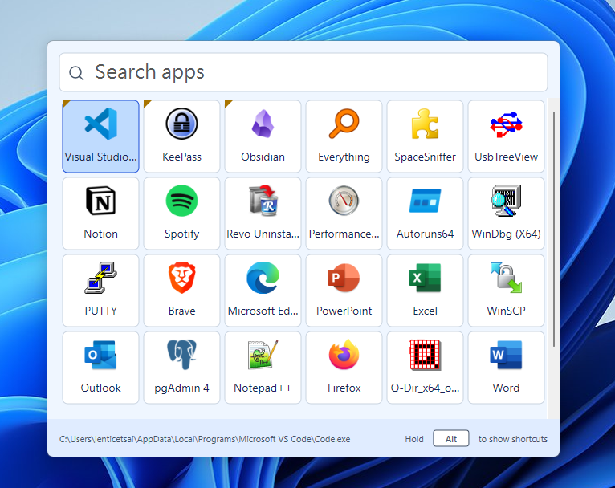
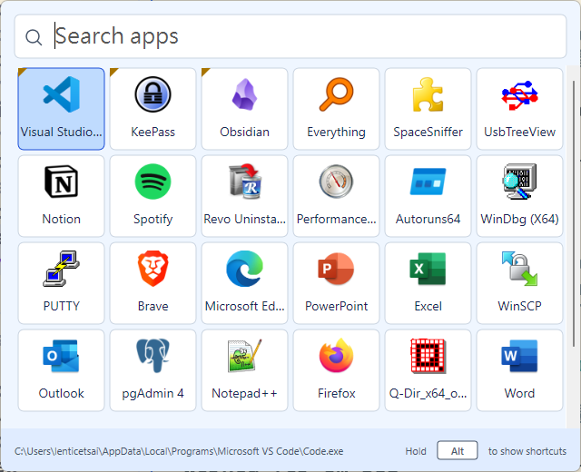

# NimbleRun

**Launch Windows apps in a keystroke — without the noise of files, web results, or AI.**

NimbleRun is a lightweight, local-first app drawer for Windows 10 and 11. Press `Alt+Space`, pick a frequently used app, or type a few letters and press `Enter`.





The live capture shows the light-blue four-row launcher layout. The native
vertical scrollbar appears only when the catalog has more items than the
visible grid/list area.

## Why NimbleRun?

- **Apps only** — results stay focused on launchable desktop and Microsoft Store apps.
- **Fast by design** — native C++20, Win32, Direct2D, and DirectWrite; no Electron or separate runtime.
- **Keyboard or mouse** — instant search, arrow-key navigation, quick-launch shortcuts, and a frequently used app grid.
- **Private and offline** — no network access, telemetry, accounts, or cloud sync.
- **Quiet in the background** — event-driven refresh instead of constant disk scanning or high-frequency timers.
- **Made for your setup** — pin and reorder apps, add local app folders, and follow the Windows light/dark theme.
- **Comfortable at a glance** — a mist-blue body, softly tinted footer, rounded app cards, and a roomy four-row grid keep the launcher easy to scan.

## How it works

1. Press `Alt+Space` to show NimbleRun.
2. Click a favorite app, or start typing to search the app catalog.
3. Use the arrow keys and `Enter` to launch, or press `Esc` to close.

NimbleRun discovers apps from the Start Menu, Windows AppsFolder, and local folders you choose. It launches them through Windows Shell APIs and keeps settings and usage data under `%LOCALAPPDATA%\NimbleRun`.

## Project status

NimbleRun is in the **Phase 5 release gate**. The launcher already includes app discovery, live catalog refresh, icons, search and usage ranking, pinning, settings, tray controls, and native tooltips.

It is not released yet. Resource-budget measurements, soak testing, release packaging, and Windows 10/11 validation are still in progress. See the [roadmap](docs/roadmap.md) and [release evidence](docs/release-evidence.md) for details.

## Build from source

### Requirements

- Windows 10 22H2 or Windows 11 x64
- LLVM-MinGW x64 toolchain
- CMake 3.25 or newer
- Ninja

From a shell with the required tools on `PATH`:

```powershell
cmake -S . -B build -G Ninja -DCMAKE_TOOLCHAIN_FILE=cmake/llvm-mingw.cmake -DCMAKE_BUILD_TYPE=Release
cmake --build build
ctest --test-dir build --output-on-failure
```

The executable is produced at `build/NimbleRun.exe`. No administrator privileges or additional runtime are required.

## Contributing

Read [AGENTS.md](AGENTS.md) before changing the project and use the [design specification](docs/design-spec.md) as the product source of truth. Development and validation guidance lives in [docs/development.md](docs/development.md) and [docs/testing.md](docs/testing.md).
