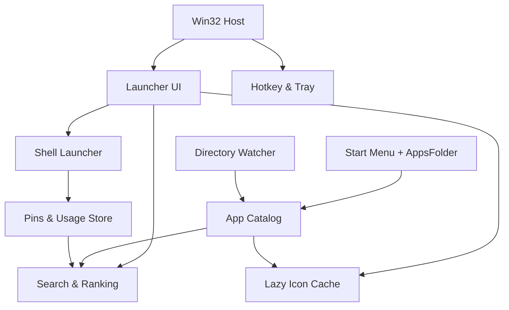

# NimbleRun Design Spec

> 極輕量 Windows App Drawer：常用 App 圖示面板＋即時搜尋

| 欄位 | 內容 |
|---|---|
| 文件版本 | 1.0 |
| 產品暫定名稱 | NimbleRun |
| 文件狀態 | MVP 開發基準 |
| 目標平台 | Windows 10 22H2／Windows 11，x64 |
| 技術基準 | C++20、原生 Win32、Direct2D／DirectWrite |
| 最後更新 | 2026-08-04 |

---

## 1. 文件目的

本文件定義 NimbleRun MVP 的產品行為、技術架構、資料模型、效能預算、驗收標準與開發順序。開發 Agent 應以本文件為實作基準；未列入 MVP 的功能不得自行擴張。

如果規格與「介面更華麗」或「增加更多搜尋能力」發生衝突，以以下順序決策：

1. 待機資源與喚出速度。
2. App 搜尋與啟動的正確性。
3. 鍵盤與滑鼠操作效率。
4. 視覺效果與額外功能。

---

## 2. 產品定義

### 2.1 一句話定位

NimbleRun 是介於 Windows 開始功能表與 Wox 類搜尋器之間的極輕量 App Drawer：空白時呈現常用 App 圖示，輸入時在同一面板即時過濾所有已安裝 App。

### 2.2 核心使用情境

使用者按下全域快捷鍵後：

- 想用滑鼠時，直接點擊常用 App 圖示。
- 想用鍵盤時，立即輸入部分名稱，以方向鍵選擇並按 Enter 執行。
- 不希望搜尋結果混入文件、網頁、新聞、設定、計算器或 AI 回答。
- 不希望背景程式持續掃描磁碟、建立全文索引或消耗明顯的 CPU／記憶體。

### 2.3 核心價值

- **立即可用**：按快捷鍵後焦點已在搜尋欄，可直接輸入。
- **視覺捷徑**：空白狀態優先呈現釘選及常用 App。
- **結果純粹**：只顯示可啟動的 App。
- **資源克制**：待機採事件驅動，不進行固定週期輪詢。
- **資料本機化**：不連網、不上傳、不收集遙測。

### 2.4 目標使用者

- Windows 10／11 桌面使用者。
- 同時使用鍵盤與滑鼠，希望快速切換 App。
- 覺得 Windows Search 過於雜亂，Wox／Flow Launcher 功能過多。
- 在意常駐程式的 CPU、記憶體與背景喚醒。

### 2.5 MVP 成功定義

MVP 必須證明以下三件事：

1. 使用者能從常用圖示或文字搜尋，在很少操作內啟動 App。
2. 程式長時間待機時不產生可觀察的持續 CPU 活動。
3. Win32 桌面程式與 Microsoft Store／封裝 App 均能被列出並正常啟動。

---

## 3. 範圍

### 3.1 MVP 包含

- 單一實例常駐。
- 全域快捷鍵顯示／隱藏面板。
- 通知區圖示及基本選單。
- 常用 App 圖示網格。
- 釘選／取消釘選 App。
- 依啟動次數與最近使用時間排列未釘選常用 App。
- 輸入時即時過濾已安裝 App。
- 滑鼠、鍵盤與觸控板操作。
- 啟動 Win32、捷徑與 Microsoft Store／封裝 App。
- 自動取得 App 名稱與圖示。
- Start Menu 變更後更新索引。
- 手動重新整理 App 目錄。
- 開機自動啟動選項。
- 淺色／深色模式跟隨系統。
- Per-monitor DPI awareness。
- 本機設定、使用統計與錯誤記錄。
- Portable ZIP 發布；不要求安裝其他 Runtime。

### 3.2 明確不包含

- 檔案、資料夾或檔案內容搜尋。
- 網頁與搜尋引擎整合。
- 計算器、命令列、Shell 指令或自訂動作。
- 外掛系統或腳本執行。
- AI、語意搜尋或雲端同步。
- 視窗切換器、剪貼簿歷史、Snippet。
- App 自動更新器。
- 多個 Deck、資料夾分組或標籤。
- App 解除安裝、更新或套件管理。
- 管理員權限啟動按鈕。
- ARM64 原生版本。
- 動畫背景、模糊／壓克力材質或長時間轉場。

不包含項目只有在 MVP 效能與使用性驗證完成後才能評估。

---

## 4. 使用者體驗

### 4.1 預設流程

1. NimbleRun 隨 Windows 啟動並進入待機，不顯示主視窗。
2. 使用者按下預設快捷鍵 `Alt+Space`。
3. 面板出現在目前游標所在螢幕的工作區中央。
4. 搜尋欄取得鍵盤焦點；欄位為空。
5. 面板顯示釘選 App，其後顯示常用 App。
6. 使用者點擊圖示，或開始輸入搜尋。
7. 成功啟動 App 後，NimbleRun 隱藏並更新本機使用紀錄。

`Alt+Space` 可能與其他 Launcher 衝突。首次註冊失敗時不得攔截或覆寫其他程式；應顯示一次非阻擋提示，要求使用者在設定中選擇其他組合。不得靜默改用候選鍵；設定頁可提供 `Ctrl+Alt+Space` 作為建議值。

MVP 不覆寫 Windows 或其他程式的系統快捷鍵。包含 Windows 鍵、已被註冊或被作業系統保留的組合，註冊失敗時一律拒絕並提醒使用者；`Win+R` 不屬於 NimbleRun 的可用快捷鍵。

### 4.2 空白查詢狀態

顯示順序：

1. 使用者釘選項目，依使用者排序。
2. 未釘選常用項目，依使用分數排序。
3. 若資料不足，補入最近啟動或字母排序靠前的 App，直到視窗可見容量。

規則：

- 同一 App 不可重複出現。
- 預設最多顯示 20 個圖示，依視窗寬度自動換行。
- 若所有項目可在一頁呈現，不顯示捲軸。
- App 名稱最多兩行；超出時使用省略號並提供 Tooltip。

### 4.3 搜尋狀態

只要搜尋欄包含非空白字元：

- 常用清單立即切換為完整 App Catalog 的過濾結果。
- 結果仍使用圖示網格，不切換成另一種頁面或混合清單。
- 第一個結果自動選取，但不可因選取而自動執行。
- 每次輸入變更後同步計算；若未來 Catalog 超過 5,000 筆或量測超標，再改用背景工作執行緒。
- 無結果時顯示「找不到 App」，不得建議網路搜尋。

### 4.4 搜尋正規化

比對前應：

- Unicode 大小寫不敏感。
- 去除頭尾空白。
- 將連續空白視為一個空白。
- 同時保留原始名稱與正規化名稱。
- MVP 不移除變音符號，不做中文拼音、注音或同義詞展開。

### 4.5 排名規則

搜尋分數由高到低：

1. 完全相同。
2. 名稱前綴相同。
3. 任一單字前綴相同。
4. 連續子字串相同。
5. 字元依序匹配（subsequence）。

同分時依序比較：

1. 已釘選優先。
2. 使用分數較高者優先。
3. 名稱較短者優先。
4. 以不區分大小寫的名稱排序，確保結果穩定。

使用分數只作為同類文字匹配的次要排序，不得讓常用但文字匹配很差的 App 壓過明確匹配。

### 4.6 使用分數

MVP 採容易驗證的衰減模型：

```text
usage_score = launch_count_30d + 3 × launch_count_7d + recency_bonus
```

`recency_bonus`：

- 24 小時內：8
- 7 天內：4
- 30 天內：1
- 超過 30 天：0

這是初始啟發式，不宣稱為最佳模型。統計只記錄 NimbleRun 自己發起且回報成功的啟動，不監控使用者從其他位置開啟 App 的行為。

### 4.7 鍵盤操作

| 按鍵 | 行為 |
|---|---|
| 全域快捷鍵 | 顯示／隱藏面板 |
| 文字輸入 | 更新過濾結果 |
| `←` `→` `↑` `↓` | 在圖示網格移動選取 |
| `Enter` | 啟動選取 App |
| `Esc` | 搜尋有內容時先清空；空白時隱藏面板 |
| `Ctrl+R` | 重新整理 App Catalog |
| `Context Menu`／`Shift+F10` | 開啟項目選單 |

Tab 順序只包含搜尋欄、結果網格及必要按鈕。面板顯示後不得將使用者輸入送到原本前景程式。

### 4.8 滑鼠操作

- 單擊 App 圖示立即啟動。
- 右鍵提供「釘選／取消釘選」及「開啟檔案位置」（適用時）。
- 點擊面板外，面板自動隱藏。
- 滾輪只在結果超過可見容量時捲動。
- 不要求雙擊，避免速度慢與行為不一致。

### 4.9 視窗外觀

- 預設寬度 640 DIP；高度依內容調整，上限為目前螢幕工作區的 70%。
- 搜尋欄位於頂端，圖示網格位於下方。
- 圖示預設 40×40 DIP；每個項目目標尺寸約 112×82 DIP。
- 使用系統字型與系統色彩語意。
- 跟隨 Windows 淺色／深色模式。
- MVP 不使用透明模糊；陰影只採系統可低成本提供的效果。
- 動畫預設關閉。若加入淡入，Release 預設總時長不得超過 80 ms，且尊重「關閉動畫」輔助設定。

### 4.10 通知區選單

- 開啟 NimbleRun。
- 重新整理 App。
- 設定。
- 關於。
- 結束。

關閉主面板只代表隱藏；「結束」才終止常駐程式。

---

## 5. 功能需求

### FR-001 單一實例

- 同一 Windows 使用者工作階段只允許一個 NimbleRun 實例。
- 第二次執行時應通知既有實例顯示面板，然後立即退出。
- 使用目前使用者範圍的命名 Mutex 搭配命名 Event 或已註冊 Window Message。
- 不使用全域跨 Session Mutex，避免多使用者環境互相阻擋。

### FR-002 全域快捷鍵

- 使用 `RegisterHotKey`，並加入 `MOD_NOREPEAT`。
- `RegisterHotKey` 失敗或快捷鍵被 Windows 保留時，拒絕該設定，不安裝低階鍵盤 hook，也不攔截任何輸入。
- 首次註冊失敗時保留通知區操作能力並顯示一次非阻擋提醒；若已有舊快捷鍵，設定失敗時保留舊快捷鍵。
- 設定新快捷鍵時，先測試註冊成功，再釋放舊快捷鍵；不得靜默切換到候選值。
- 程式結束時呼叫 `UnregisterHotKey`。

### FR-003 App Catalog

Catalog 至少包含：

1. 目前使用者 Start Menu：`FOLDERID_Programs`。
2. 所有使用者 Start Menu：`FOLDERID_CommonPrograms`。
3. Windows Apps Folder：`FOLDERID_AppsFolder`。

不得使用硬編碼英文目錄。所有 Known Folder 路徑以 Shell Known Folder API 取得。

每個 Catalog 項目至少包含：

```cpp
enum class AppSource : uint8_t {
    UserStartMenu,
    CommonStartMenu,
    AppsFolder
};

struct AppEntry {
    std::wstring stable_id;
    std::wstring display_name;
    std::wstring normalized_name;
    std::wstring launch_identity;
    std::wstring source_path;
    AppSource source;
    bool is_pinned;
};
```

實作可加入欄位，但 UI 不得直接持有 Shell COM pointer；Catalog 應是可複製、可排序的普通資料。

### FR-004 Start Menu 項目

- 遞迴列舉兩個 Programs Known Folder。
- MVP 接受 `.lnk` 與 `.appref-ms`；直接 `.exe` 僅在它實際位於 Programs 資料夾時接受。
- `.lnk` 以 `IShellLinkW`／`IPersistFile` 解析，禁止自行解析二進位格式。
- 顯示名稱預設採捷徑檔名，不含副檔名。
- 無法解析但 Shell 可正常開啟的捷徑仍可保留，啟動時交給 Shell。
- 排除解除安裝、說明、網站捷徑等非 App 項目；初版採保守副檔名與 Shell 屬性判斷，不以名稱黑名單作唯一依據。

### FR-005 Microsoft Store／封裝 App

- 透過 `FOLDERID_AppsFolder` 的 Shell namespace 列舉，不掃描 `WindowsApps` 目錄，不要求存取受保護檔案。
- 保存 Shell parsing name 或等價的穩定啟動識別。
- 顯示名稱與圖示由 Shell property／image API 取得。
- 啟動交由 Shell，不直接尋找或執行封裝目錄內的 EXE。

### FR-006 去重複

優先以正規化後的 launch identity 去重。若不同來源指向同一目標：

1. 保留能由 Shell 正確啟動且圖示品質較佳的項目。
2. 使用者 Start Menu 優先於 Common Start Menu。
3. 若 packaged App 的 Start Menu 捷徑與 AppsFolder 項目無法可靠判定相同，寧可暫時保留，並記錄診斷資訊；不得只用顯示名稱合併。

### FR-007 Catalog 更新

- 啟動時建立 Catalog。
- 以 `ReadDirectoryChangesW` 非同步監看兩個 Programs 資料夾。
- 收到密集事件時 debounce 500 ms，合併成一次重掃。
- AppsFolder 不做背景輪詢；當面板被叫出且距上次 AppsFolder 列舉超過 10 分鐘時，在背景低優先序重新列舉並原子替換結果。
- 使用者可用 `Ctrl+R` 強制完整重建。
- 重建期間沿用舊 Catalog；成功後才整批替換，不顯示半完成結果。

### FR-008 圖示

- 透過 Windows Shell 取得圖示，不自行進入封裝目錄。
- 圖示採 lazy loading，只載入目前可見項目。
- 快取鍵由 stable ID、要求尺寸及 DPI 組成。
- 記憶體 LRU cache 預設上限 64 個 decoded bitmap；離開可見區域不代表立即釋放。
- Catalog 不預解碼所有圖示。
- 取得失敗時顯示單一內建 fallback icon。
- 第一幀允許先顯示 fallback，再非同步更新真實圖示，但不可造成格位重排。

### FR-009 App 啟動

- 使用 Unicode 版本 `ShellExecuteExW` 或 Shell item verb。
- UI 執行緒已初始化 STA COM：`COINIT_APARTMENTTHREADED | COINIT_DISABLE_OLE1DDE`。
- 啟動成功後立即隱藏面板並更新統計。
- 啟動失敗時保持面板顯示，呈現簡短錯誤及「重新整理」選項。
- 不拼接命令列字串後交給 `CreateProcess`，避免引號及參數錯誤。
- 除非功能明確要求程序 Handle，否則不要使用 `SEE_MASK_NOCLOSEPROCESS`；若取得 Handle，必須關閉。

### FR-010 釘選與排序

- 項目右鍵可釘選或取消。
- 釘選項目可用拖曳調整順序；MVP 若拖曳延誤開發，可先提供「向前／向後移動」。
- App 暫時不存在時保留 pin 紀錄 30 天；若重新安裝且 stable ID 相同，自動恢復。
- 30 天後仍不存在的 pin 可在設定頁清理，但不得在第一次掃描失敗時立即刪除。

### FR-011 開機啟動

- 預設關閉，由使用者主動開啟。
- Portable MVP 使用目前使用者 Startup Known Folder 的捷徑，或 `HKCU\Software\Microsoft\Windows\CurrentVersion\Run`；實作擇一並集中封裝。
- 不寫入 HKLM，不要求管理員權限。
- 移動 EXE 後若啟動項目失效，設定頁應能重新建立。

### FR-012 設定

MVP 設定：

- 全域快捷鍵。
- 快捷鍵衝突提示與設定入口。
- 開機自動啟動。
- 跟隨系統／淺色／深色。
- 常用 App 顯示數量：8～40，預設 20。
- 啟動 App 後是否隱藏：預設開啟。
- 清除使用紀錄。
- 重設設定。

設定頁不必使用獨立框架，可用原生 modal／property sheet 或同一自繪視窗中的簡單頁面。

### FR-013 記錄與診斷

- 正常模式不輸出逐鍵搜尋紀錄。
- 錯誤記錄採有上限的循環／輪替檔案，單檔上限 512 KiB，最多保留 2 份。
- 不記錄搜尋文字、使用者名稱、完整個人目錄或命令列參數。
- 可記錄 HRESULT／Win32 error、來源類型、雜湊後 stable ID 及階段名稱。
- 設定頁提供「開啟記錄資料夾」。

---

## 6. 非功能需求

### NFR-001 資源預算

以下是 MVP 的工程目標，不是未量測的保證。所有數字均以 x64 Release、未附加 Debugger、完成初次索引並待機 60 秒後量測。

| 指標 | 目標 | 阻擋發布門檻 |
|---|---:|---:|
| 待機 CPU（15 分鐘平均） | ≤ 0.1% 單一邏輯 CPU 等效 | > 0.5% |
| 待機工作集 | ≤ 20 MiB | > 35 MiB |
| 待機 Private Bytes | ≤ 15 MiB | > 30 MiB |
| 面板顯示、20 個圖示完成後工作集 | ≤ 35 MiB | > 55 MiB |
| 冷啟動至可接收快捷鍵 | ≤ 500 ms | > 1,000 ms |
| 暖狀態快捷鍵至可輸入 | p95 ≤ 80 ms | p95 > 150 ms |
| 500 個 App 的單次過濾 | p95 ≤ 8 ms | p95 > 16 ms |
| 待機執行緒數 | ≤ 4 | > 8 |

量測條件至少包含：

- Windows 11 x64 一台日常開發機。
- Windows 11 x64 一台較低階或 VM 環境。
- Catalog 約 100、500、2,000 筆的合成測試。
- 100%、150%、200% DPI。

工作集會受系統共享頁面、Shell extension、圖示解碼及安全軟體影響，因此同時記錄 Working Set、Private Working Set、Private Bytes、CPU time 與執行緒數，不可只看工作管理員單一欄位。

### NFR-002 待機模型

- 主執行緒阻塞於 `GetMessage`／`MsgWaitForMultipleObjectsEx`，沒有工作時不使用 busy loop。
- 禁止固定小於 60 秒的 timer。
- 禁止為維持 UI 而持續重繪。
- 監控目錄採 OS completion／event 通知。
- 背景執行緒完成工作後應回收；不得建立常駐 thread pool 只為未來可能的工作。

### NFR-003 可用性

- 任一 App 圖示失敗不得使 Catalog 建立失敗。
- 任一損壞捷徑不得造成崩潰或卡住整體掃描。
- Catalog 重建可取消或具世代編號；舊工作完成後不得覆蓋較新的結果。
- 設定寫入採 temporary file＋atomic replace，避免斷電造成整份設定損壞。
- 崩潰後下次啟動仍可重建 Catalog，不依賴不可恢復的 cache。

### NFR-004 安全

- 程式以標準使用者權限執行，manifest 使用 `asInvoker`。
- 不安裝 Service、Driver 或排程工作。
- 不從網路下載或執行內容。
- 搜尋只過濾既有 Catalog，不把輸入當成命令列或 URI 執行。
- 使用者點擊的項目必須對應 Catalog 中已解析的 launch identity。
- 不繞過 SmartScreen、UAC 或 Windows Shell 安全行為。

### NFR-005 隱私

- 無網路功能，Windows Firewall 阻擋後核心功能不得受影響。
- 不含遙測 SDK、廣告 SDK、Crash upload 或裝置識別碼。
- 使用紀錄只儲存在目前使用者的 LocalAppData。
- 提供清除使用紀錄功能。

### NFR-006 無障礙與在地化

- 所有 App item 提供可存取名稱。
- 鍵盤可完成全部核心操作。
- 選取狀態不可只靠顏色表示。
- 尊重系統高對比、文字縮放、DPI 與動畫設定。
- 內部字串使用 UTF-16；檔案交換格式使用 UTF-8。
- MVP UI 至少提供英文與繁體中文，若時程不足，程式碼仍須集中管理字串，不可散落硬編碼。

### NFR-007 相容性

- 主要支援 Windows 11 x64。
- 相容 Windows 10 22H2 x64，但 Windows 10 已結束一般支援；此處僅代表應用程式相容性，不代表作業系統安全支援承諾。
- Windows on ARM 可透過 x64 emulation 作為非阻擋相容情境；ARM64 原生建置列入後續版本。
- 不支援 Windows 7／8.1。

---

## 7. 技術選型

### 7.1 最終選型

| 項目 | 選擇 |
|---|---|
| 語言 | C++20 |
| UI | 原生 Win32 HWND＋Direct2D／DirectWrite |
| Shell 整合 | Windows Shell COM API |
| 圖示 | Shell image/icon API，lazy load |
| 建置 | CMake＋Ninja＋LLVM-MinGW（Clang／LLD，x86_64-w64-windows-gnu） |
| 字元集 | Unicode only |
| Runtime | LLVM-MinGW UCRT static runtime `-static`、Release `-O2` |
| 安裝方式 | Portable ZIP；單一主 EXE |
| 外部依賴 | MVP 目標為零第三方 runtime dependency |

### 7.2 為何不選其他方案

| 方案 | 不採用原因 |
|---|---|
| WPF | 需要 .NET runtime，反射與 UI framework 成本不符合極輕量目標；trimming 相容性也不理想。 |
| WinUI 3 | 需要 Windows App SDK runtime／bootstrap 或 self-contained 部署，增加記憶體與部署複雜度。 |
| WinForms | 開發較快，但常駐 managed runtime 成本高於此產品所需。可作為原型，不作正式 MVP。 |
| Qt | 對單一 Windows popup 與 Shell 整合過重。 |
| Electron | Chromium／Node runtime 明顯偏離資源目標。 |
| Rust＋第三方 GUI | 核心可很輕，但 Windows Shell COM 與成熟原生 UI 的工程成本高於 C++ Win32。 |
| Native AOT C# | 可降低 JIT 成本，但 COM、trimming 與 UI 選型限制使第一版風險較高。 |

### 7.3 Direct2D／DirectWrite 邊界

- 使用 Windows 內建系統元件，不隨程式附帶額外 runtime。
- 只在視窗首次顯示時建立 device-independent resource；device-dependent resource 依 HWND 建立。
- 收到 device loss 時安全重建。
- 視窗隱藏時停止動畫與重繪，但可保留小型 factory/resource，是否釋放由量測決定。
- 若 Direct2D 初始化失敗，MVP 可直接顯示錯誤並停止，不要求實作完整 GDI fallback。

---

## 8. 開發與執行環境

### 8.1 開發機

- Windows 11 x64 為主要開發環境。
- LLVM-MinGW x64 toolchain（Clang／LLD／mingw-w64）。
- CMake：3.25 以上；專案 `cmake_minimum_required(VERSION 3.25)`。
- Ninja。
- Git。

Visual Studio 與 MSVC 不列為必要開發環境。LLVM-MinGW 的原生 Windows ZIP 內含 C++ runtime、mingw-w64 headers、LLD 與 `llvm-rc`，可搭配 Ninja 直接建置。

### 8.2 執行機

- Windows 10 22H2 x64 或 Windows 11 x64。
- 不要求安裝 .NET、Windows App SDK 或 VC++ Redistributable。
- 不要求管理員權限。
- 可從使用者具寫入權限的任意資料夾執行。
- 執行資料永遠寫入 `%LOCALAPPDATA%\NimbleRun`，不寫入 EXE 所在目錄，避免 Program Files 與唯讀媒體問題。

### 8.3 建置設定

Debug：

- `-g` 與必要的 debug checks；不作效能驗收。
- 啟用 iterator/debug checks。
- 啟用 AddressSanitizer 的獨立測試設定（不與所有 Win32 API 情境保證相容）。

Release：

- `-O2` 與可用時的 link-time optimization。
- `-static` 靜態連結 UCRT、C++ 與 LLVM runtime。
- `/DUNICODE /D_UNICODE`。
- 啟用 Control Flow Guard、ASLR、DEP、High Entropy VA。
- 產出 PDB，但 ZIP 發布包預設不包含 PDB。
- 不以 UPX 或其他可執行檔壓縮器縮小體積，避免啟動、記憶體共享及防毒誤判問題。

### 8.4 建置輸出

```text
dist/
├── NimbleRun.exe
├── LICENSE.txt
└── README.txt
```

第一版可以有內嵌 resource（字串、fallback icon、manifest）；不得額外散落主題、JavaScript 或 runtime DLL。

---

## 9. 系統架構



### 9.1 模組責任

| 模組 | 責任 | 不得負責 |
|---|---|---|
| `app_host` | WinMain、message loop、COM、single instance、生命週期 | 搜尋排名 |
| `launcher_window` | HWND、焦點、輸入、繪製、DPI | 掃描磁碟 |
| `app_catalog` | 合併、去重、快照、世代管理 | 直接繪 UI |
| `start_menu_source` | Known Folder 與捷徑列舉 | 使用紀錄 |
| `apps_folder_source` | Shell AppsFolder 列舉 | 掃 WindowsApps |
| `catalog_watcher` | 目錄變更通知與 debounce | 固定輪詢 |
| `search_engine` | 正規化、匹配、穩定排序 | Shell 呼叫 |
| `icon_cache` | 非同步取得、LRU、DPI key | 永久保存全部 bitmap |
| `shell_launcher` | Shell 啟動與錯誤映射 | 自行解析任意命令列 |
| `usage_store` | pins、順序、啟動統計、原子寫入 | 監控其他程式活動 |
| `settings_store` | 設定讀寫與 migration | App Catalog cache |
| `diagnostics` | 有界記錄、效能標記 | 記錄搜尋文字 |

### 9.2 執行緒模型

- UI thread：Win32 message loop、HWND、Direct2D、輸入、Catalog snapshot 交換。
- Scan worker：只在啟動、目錄變更或手動刷新時存在。
- Icon worker：單一低優先序 worker，依可見項目載入；queue 有上限並可取消過期請求。
- Directory watcher：優先使用 overlapped I/O 與 UI／worker wait integration；若使用專用 thread，必須長時間阻塞等待事件。

不得為每個圖示建立一個 thread。Catalog 以 `shared_ptr<const CatalogSnapshot>` 或等價 immutable snapshot 在執行緒間交換，UI 不鎖住掃描工作。

### 9.3 啟動序列

1. 檢查 single-instance Mutex。
2. 初始化 DPI awareness context。
3. 初始化 UI thread STA COM。
4. 載入設定與最小使用資料。
5. 建立隱藏 message window／launcher window。
6. 依設定註冊 `RegisterHotKey`，再建立通知區圖示；失敗時保留 tray 並顯示一次非阻擋提醒。
7. 載入可選 Catalog cache，若有效可先提供結果。
8. 背景建立最新 Catalog。
9. 啟動 Programs directory watcher。
10. 主執行緒進入阻塞式 message loop。

即使 Catalog 尚未完成，快捷鍵也應能叫出面板並顯示「正在準備 App」。

### 9.4 關閉序列

1. 停止接受新的背景工作。
2. 取消 watcher 與 icon request。
3. 寫入尚未保存的使用資料。
4. 移除通知區圖示。
5. 解除全域快捷鍵。
6. 釋放 Direct2D 與 COM resource。
7. 銷毀視窗、釋放 Mutex、結束程序。

關閉不得因等待 Shell extension 無限卡住；worker join 應有可控取消路徑。

---

## 10. 資料儲存

### 10.1 目錄

```text
%LOCALAPPDATA%\NimbleRun\
├── settings.ini
├── favorites.txt
├── usage.tsv
├── catalog.cache
└── logs\
    ├── nimblerun.log
    └── nimblerun.log.1
```

### 10.2 格式選擇

- `settings.ini`：少量 key/value，使用 Win32 profile API 或受測試的自有 reader/writer。
- `favorites.txt`：UTF-8，每行一個經 escaping 的 stable ID，行序即 pin 順序。
- `usage.tsv`：版本化 UTF-8 TSV；欄位為 stable ID、總啟動數、7／30 日 buckets 或必要時間資料、最後啟動 UTC。
- `catalog.cache`：可選的版本化二進位 cache，只用於加速，不是真實來源；讀取錯誤可直接刪除並重建。

不得因為資料量小就引入 SQLite。所有持久資料寫入應先寫 `.tmp`，flush 成功後以 replace 方式提交。

### 10.3 Stable ID

- Start Menu 項目：以正規化 Shell parsing identity／resolved target 加必要參數產生 SHA-256 或穩定雜湊表示。
- AppsFolder 項目：以 Shell parsing name／AUMID 產生。
- stable ID 不可依顯示名稱、圖示或目前排序產生。
- hash 用於識別，不作安全信任判斷。

### 10.4 Migration

每種資料格式第一行包含 schema version。遇到較新且不支援的版本：

- 不覆寫原檔。
- 將功能退回安全預設。
- 顯示一次錯誤提示。

舊版本升級需有單元測試；Catalog cache 不需要 migration，可直接重建。

---

## 11. 錯誤處理

| 情境 | 使用者行為 | 系統行為 |
|---|---|---|
| 快捷鍵衝突 | 由 tray 開啟設定 | 保持常駐，不反覆註冊 |
| 快捷鍵無法註冊 | 由 tray 開啟設定 | 拒絕新設定，不攔截任何按鍵；已有快捷鍵則保留 |
| 單一捷徑損壞 | 該 App 可略過或顯示 fallback | 記錄錯誤，繼續掃描 |
| 圖示取得失敗 | 顯示 fallback icon | 不影響啟動 |
| App 已解除安裝 | 啟動失敗提示 | 觸發一次 Catalog refresh |
| AppsFolder 列舉失敗 | 仍顯示 Win32 App | 下次使用者叫出時再試，不高頻 retry |
| 設定損壞 | 採預設值並通知 | 原檔改名保存，不靜默覆寫 |
| Direct2D device loss | 當前畫面可短暫空白 | 重建 device resource |
| Worker 發生例外 | UI 不崩潰 | 捕捉邊界、記錄並丟棄該次結果 |

錯誤提示不得使用會搶焦點的連續 MessageBox。面板內提示或 tray balloon 只在使用者可採取動作時使用。

---

## 12. 測試策略

### 12.1 單元測試

- Unicode 正規化與大小寫比對。
- 五層搜尋匹配及穩定排序。
- 使用分數時間邊界。
- 去重複規則。
- stable ID 一致性。
- INI／favorites／usage 的 round-trip、escaping 與損壞輸入。
- schema migration。
- LRU cache 淘汰策略。
- Catalog snapshot 世代順序。

### 12.2 整合測試

- 建立含正常、損壞、參數、Unicode 名稱及深層子目錄的測試 Start Menu。
- 修改／新增／刪除捷徑後 watcher 只重建一次。
- 列舉並啟動至少三個 Win32 App。
- 列舉並啟動至少三個 inbox packaged App，例如 Calculator、Settings 對應項目；實際清單依 OS 映像調整。
- Hotkey 衝突與重新設定。
- 無法註冊或被 Windows 保留的快捷鍵會被拒絕並提醒，且 Windows 原生行為保持不變。
- 第二實例喚醒第一實例。
- EXE 位於含空白與非 ASCII 字元路徑。
- 無網路與標準使用者權限下完整運作。

### 12.3 UI 測試

- 空白查詢顯示 pins＋常用 App。
- 輸入後同一 grid 原地過濾。
- 方向鍵跨行移動。
- Esc 兩階段行為。
- 點擊外部自動隱藏。
- 主螢幕與第二螢幕不同 DPI。
- 工作列在上下左右各方向。
- 高對比與淺／深色。
- 長名稱、中文、日文、Emoji 與 RTL 名稱不崩潰；MVP 不保證完整 RTL 版面最佳化，但文字不得損壞。

### 12.4 效能測試

建立 `perf_harness` 或可重複 script，量測：

- 冷啟動、暖喚出。
- 100／500／2,000 筆搜尋延遲分布。
- 連續輸入 30 秒時 UI thread frame／input latency。
- 顯示 20／40 個圖示後的 working set。
- 隱藏後 15 分鐘 CPU time 與 context switches。
- 1,000 次顯示／隱藏是否持續增加 GDI object、USER object、Handle 或 Private Bytes。

不得用 Debug build 作發布門檻判定。

### 12.5 穩定性測試

- 連續常駐 72 小時。
- Explorer 重啟。
- 睡眠／喚醒。
- 使用者登出／登入。
- 顯示中解除安裝 App。
- Catalog 重建中快速結束程式。
- 大量目錄變更事件。

---

## 13. 驗收標準

### AC-001 基本啟動

Given NimbleRun 正在待機，When 使用者按下有效快捷鍵，Then 面板在目前螢幕顯示，搜尋欄已取得焦點，且使用者可立即輸入。

### AC-002 常用面板

Given 搜尋欄為空，When 面板顯示，Then 釘選 App 依自訂順序優先顯示，其後為不重複的常用 App。

### AC-003 即時過濾

Given Catalog 已建立，When 使用者逐字輸入，Then 圖示網格在每次輸入後更新，只顯示符合名稱的 App，且不出現檔案、網頁或設定結果。

### AC-004 鍵盤啟動

Given 搜尋結果存在，When 使用者以方向鍵選擇並按 Enter，Then Shell 成功啟動該 App、面板隱藏、使用紀錄增加一次。

### AC-005 滑鼠啟動

Given 常用圖示可見，When 使用者單擊圖示，Then App 被啟動且面板依設定隱藏。

### AC-006 App 覆蓋

Given 標準 Windows 11 測試環境，When 完整重建 Catalog，Then 能列出並啟動 Start Menu Win32 App 與 AppsFolder packaged App。

### AC-007 更新

Given Programs folder 新增或刪除捷徑，When 目錄通知完成 debounce，Then Catalog 在不阻塞 UI 的情況下更新，且不需要重啟 NimbleRun。

### AC-008 離線與隱私

Given 網路完全阻擋，When 執行全部核心流程，Then 搜尋、圖示及啟動均可使用，且程式不嘗試建立必要的外部連線。

### AC-009 資源

Given Release x64 build 依 NFR-001 條件量測，Then 所有阻擋發布門檻均通過；未達目標但未超過阻擋門檻的項目需建立已知問題與後續工作。

### AC-010 可恢復性

Given Catalog cache 損壞或單一捷徑異常，When NimbleRun 啟動，Then 程式不崩潰，能重建有效項目並保留 pins／usage 資料。

### AC-011 快捷鍵衝突處理

Given 快捷鍵已被其他程式註冊或被 Windows 保留，When 使用者設定該組合，Then NimbleRun 拒絕新設定、不攔截原生輸入、保留既有可用快捷鍵，並顯示一次非阻擋提醒與設定入口。

---

## 14. 建議專案結構

```text
NimbleRun/
├── CMakeLists.txt
├── cmake/
├── docs/
│   └── design-spec.md
├── src/
│   ├── app_host/
│   ├── catalog/
│   ├── search/
│   ├── shell/
│   ├── storage/
│   ├── ui/
│   ├── diagnostics/
│   └── resources/
├── tests/
│   ├── unit/
│   ├── integration/
│   └── perf/
├── tools/
└── packaging/
```

核心邏輯如搜尋、排名、去重與 usage scoring 應保持無 HWND／COM 依賴，以便快速單元測試。

---

## 15. 開發 Backlog

### Phase 0：效能探針

- 建立最小 Win32 popup、message loop、`RegisterHotKey`，並驗證快捷鍵衝突時的拒絕與提醒。
- 建立 Direct2D 文字與 20 個假圖示 grid。
- 量測空視窗與顯示視窗的 working set、private bytes、喚出時間。
- 若空框架已超過 NFR 阻擋門檻，先修正架構，不進入功能開發。

### Phase 1：可啟動的垂直切片

- Single instance。
- Hotkey＋tray。
- Start Menu `.lnk` 列舉。
- 純文字／fallback icon grid。
- 搜尋與 Enter／click 啟動。
- 基本單元測試。

完成定義：可以從 ZIP 執行，搜尋並啟動至少 20 個真實 Win32 App。

### Phase 2：完整 App Catalog

- AppsFolder 列舉。
- 去重與 stable ID。
- Directory watcher。
- Catalog snapshot 與 refresh generation。
- 錯誤隔離。

完成定義：Win32 與 packaged App 均可搜尋啟動；安裝／移除捷徑後能更新。

### Phase 3：視覺面板

- Shell icon lazy loading。
- LRU cache。
- DPI、深淺色、高對比。
- 鍵盤網格導覽。
- 焦點與外部點擊隱藏。

完成定義：100%、150%、200% DPI 無明顯錯位，圖示載入不阻塞輸入。

### Phase 4：常用與設定

- Pin／unpin 與排序。
- Usage scoring。
- 設定頁。
- 開機啟動。
- 原子儲存與 migration。

完成定義：重新啟動後 pins、順序、usage 與設定保持一致。

### Phase 5：發布門檻

- 完成效能 harness。
- 72 小時 soak test。
- Handle／GDI／memory leak 測試。
- Portable ZIP、README、LICENSE。
- Windows 10 22H2 與 Windows 11 相容驗證。
- 安全 flags 與不需管理員權限驗證。

完成定義：所有 AC 通過，NFR-001 無阻擋項目。

---

## 16. 風險與緩解

| 風險 | 影響 | 緩解方式 |
|---|---|---|
| Shell extension／損壞捷徑拖慢掃描 | 啟動或 refresh 卡頓 | 掃描在 worker；逐項錯誤隔離；舊 snapshot 持續可用 |
| 圖示解碼導致記憶體增加 | 超過輕量定位 | lazy load、有界 LRU、固定尺寸、壓力測試 |
| AppsFolder parsing identity 在版本間差異 | packaged App 無法啟動／pin 失效 | 保留 Shell canonical identity；建立 OS 版本整合測試；失敗時 refresh |
| Hotkey 與 Wox／PowerToys 衝突 | 無法叫出 | 不搶占；首次提示；提供備選快捷鍵 |
| 快捷鍵衝突 | 無法叫出 | 拒絕新設定、保留舊設定、一次提醒、提供 tray 設定入口 |
| 使用分數讓結果看似不穩定 | 使用者難預測 | 文字分數為主；usage 只作次要排序；提供 pin |
| 資源目標受防毒與 OS 版本影響 | 測量不一致 | 多機量測、同時記錄多項 process 指標、保留原始報告 |
| C++ Win32 開發成本 | MVP 延遲 | 嚴格限縮功能；核心邏輯模組化；先做 Phase 0／1 垂直切片 |
| Windows 10 已停止一般支援 | 維護與安全認知 | 標示為相容而非安全支援；Windows 11 作主要測試平台 |

---

## 17. 發布後評估指標

MVP 不內建遙測。若開發者或測試者自願提供本機測試報告，只評估：

- 快捷鍵至可輸入的 p50／p95。
- 待機 CPU time、context switches、working set、private bytes。
- App Catalog 數量與完整重建時間。
- 搜尋無結果率（只能由測試者明確匯出；預設不記錄查詢字串）。
- 啟動失敗率，依來源類型分類，不包含個人路徑。
- 使用者以點擊或鍵盤啟動的比例。

是否加入任何 opt-in telemetry 必須另立隱私設計，不屬於本規格。

---

## 18. 後續版本候選

只有在 MVP 通過資源與穩定性門檻後，依使用證據評估：

- ARM64 原生建置。
- 多個 Deck／工作情境分組。
- 自訂捷徑、URL 與資料夾，但與 App 搜尋清楚分區。
- 中文拼音／注音搜尋別名。
- 自動辨識真正的全系統使用頻率；需先評估隱私與背景成本。
- MSIX 安裝包與自動更新。
- 可選的簡短顯示動畫。

外掛、AI、全文檔案搜尋與雲端同步不列為自然延伸；若未來要做，應視為另一個產品層級重新設計。

---

## 19. 重要實作原則摘要

1. 空白顯示常用 App；輸入後在同一 grid 過濾完整 App Catalog。
2. 只搜尋 App，不搜尋檔案、網頁或其他內容。
3. C++20＋原生 Win32；不使用 WPF、WinUI 3、Qt 或 Electron。
4. 待機完全事件驅動，不使用高頻 timer 或背景掃描。
5. 不掃描整顆磁碟，也不直接存取受保護的 WindowsApps。
6. 圖示延遲載入並限制 cache；不能讓 UI 等待圖示。
7. Catalog 使用 immutable snapshot；背景重建成功後一次替換。
8. 啟動交給 Windows Shell，UI 不拼接任意命令列。
9. 無網路、無遙測、標準使用者權限、資料只留本機。
10. 所有「輕量」主張都以 Release 實機數據驗證，不以感覺或 EXE 大小代替。

---

## 20. 技術依據

- Microsoft `RegisterHotKey` 文件：<https://learn.microsoft.com/windows/win32/api/winuser/nf-winuser-registerhotkey>
- WOX 官方舊版 Basic Usage（Win+R replacement）：<https://doc.wox.one/en/basic/>
- WOX 官方現行 Introduction（預設 `Alt+Space`）：<https://wox-launcher.github.io/Wox/guide/introduction.html>
- Microsoft `ShellExecuteEx` 文件：<https://learn.microsoft.com/windows/win32/api/shellapi/nf-shellapi-shellexecuteexw>
- Microsoft Shell Links 文件：<https://learn.microsoft.com/windows/win32/shell/links>
- Microsoft Known Folders 文件：<https://learn.microsoft.com/windows/win32/shell/known-folders>
- Microsoft Direct2D 文件：<https://learn.microsoft.com/windows/win32/direct2d/direct2d-portal>
- Microsoft Per-monitor DPI awareness 文件：<https://learn.microsoft.com/windows/win32/hidpi/high-dpi-desktop-application-development-on-windows>

技術 API 細節以實作當下安裝之正式 Windows SDK header 與 Microsoft Learn 文件為準。若文件與實際 SDK 宣告不同，需記錄 SDK 版本並以可重現測試確認，不得自行推測行為。
